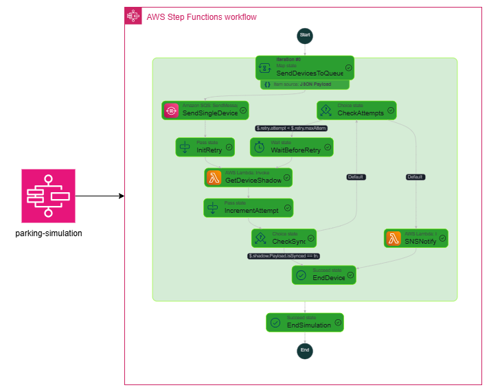

# iot-parking-simulator

---
# 🚗 Smart Parking Simulator

A serverless IoT project that simulates a network of smart parking sensors using AWS IoT Core, SQS/SNS, and RDS (PostgreSQL).
It demonstrates event-driven data ingestion, asynchronous processing, notifications, and data persistence in a fully serverless architecture.

---
# 📌 Project Overview

This project simulates parking spot sensors that periodically publish their status (available or occupied) to AWS IoT Core using MQTT.

The events are processed using an event-driven, fully serverless architecture built on AWS, where **AWS Step Functions orchestrate the workflow per device**, enabling controlled retries, state validation, and predictable execution.

The system processes and distributes events through different components:

- **AWS IoT Core (MQTT)** → Ingests parking sensor events.
- **AWS Step Functions** → Orchestrates the end-to-end workflow per parking spot, including asynchronous processing, bounded retries, and state convergence validation.
- **AWS Lambda** → Executes business logic such as shadow reads, database updates, and notifications.
- **Amazon RDS (PostgreSQL)** → Persists parking state changes and execution results.
- **Amazon SQS** → Decouples event ingestion from processing and enables asynchronous and batch-oriented workflows.
- **Amazon SNS** → Sends notifications when business rules are triggered (e.g., parking state not converging after multiple attempts).


---
# 🏗️ Architecture

The system is orchestrated using AWS Step Functions, which processes each parking device independently through a Map state.  
Device events are ingested via AWS IoT Core (MQTT) and handled using an event-driven, fully serverless workflow.

For each device, the workflow:
- Sends the event to an Amazon SQS queue to decouple ingestion from processing.
- Polls the device state (via AWS IoT Shadows) using bounded retries and wait states.
- Validates state convergence without relying on real-time streaming mechanisms.
- Persists execution results and parking state changes in Amazon RDS (PostgreSQL).
- Triggers Amazon SNS notifications only when business rules are violated (e.g., state not converging after multiple attempts).

This design ensures predictable execution, cost control, and a clear separation between business-state outcomes and technical failures.



---
# ⚡ Features

- **MQTT-based IoT Simulation**: multiple parking sensors publishing available/occupied events to AWS IoT Core.
- **Workflow Orchestration**: per-device orchestration using AWS Step Functions, including bounded retries and state validation.
- **Data Persistence**: parking state changes and execution results stored in Amazon RDS (PostgreSQL).
- **Notifications**: SNS notifications triggered when business rules are met (e.g., state not converging after multiple attempts).
- **Asynchronous Processing**: SQS used to decouple event ingestion from processing and enable future batch use cases (metrics, aggregations).
- **Serverless Infrastructure**: infrastructure defined using AWS SAM and deployed through CI/CD pipelines.

---
# 🛠️ Tech Stack

- **AWS Services**:
  - AWS IoT Core (MQTT)
  - AWS Step Functions
  - AWS Lambda
  - Amazon RDS (PostgreSQL)
  - Amazon SQS
  - Amazon SNS
  - AWS IAM

- **Infrastructure as Code**:
  - AWS SAM (Serverless Application Model)

- **Languages**:
  - Node.js (Lambdas, IoT simulator)
  - SQL (RDS schema and queries)

- **CI/CD**:
  - GitHub Actions

--- 
# 🚀 CI/CD

The project uses GitHub Actions to automatically build and deploy the serverless application using AWS SAM.
The pipeline validates the infrastructure, packages the application, and deploys it to AWS in a repeatable and automated way.


--- 
# 📊 Example Event Payload

```json
{
  "devices": [
    { "slotId": "PARK001", "status": "occupied" },
    { "slotId": "PARK002", "status": "available" }
  ]
}

```
# ✅ Use Cases

- **Smart city solutions**: managing parking lots using event-driven IoT workflows and eventual state convergence.
- **Industrial IoT scenarios**: device telemetry processed asynchronously with decoupled, serverless components.
- **Educational / portfolio project**: demonstrating an end-to-end serverless IoT architecture using AWS managed services.
